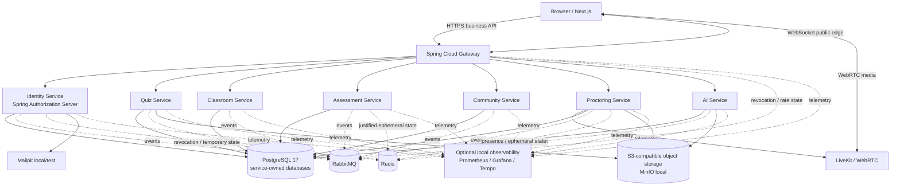

# System Architecture

Status: **Accepted pre-scaffold baseline v0.2**

## Architectural style

Quizopia 2.0 uses **coarse-grained microservices** in a true monorepo.

The purpose is clear ownership and independently scalable workloads, not maximizing service count.

## Logical topology

This is a logical architecture. Deployment topology may evolve without violating service ownership.

## Public edge

Spring Cloud Gateway is the public business/API edge.

Browser business HTTP calls do not target backend microservices directly.

Public WebSocket endpoints are routed through the edge topology.

WebRTC media is intentionally separate and connects to LiveKit.

## Business services

- Identity Service
- Quiz Service
- Classroom Service
- Assessment Service
- Community Service
- Proctoring Service
- AI Service

No standalone Grading Service is part of the baseline; grading stays with Assessment to preserve transactional correctness.

## Authentication topology

Identity Service acts as Quizopia's authorization server.

It issues Quizopia credentials/tokens after local or Google-based authentication.

Gateway and each protected service validate user JWTs independently using Quizopia public signing material/JWKS.

Internal synchronous service calls use OAuth2 Client Credentials service JWTs.

## Communication

### Authoritative business operations

Use transactional HTTP/REST APIs.

Examples:

- start/autosave/submit attempt;
- create/update quiz;
- classroom membership commands;
- result retrieval.

### Synchronous internal service communication

Use direct internal REST when the caller needs an immediate answer.

Do not route service-to-service traffic through the public gateway.

### Integration events

Use RabbitMQ for asynchronous business facts.

Critical events require transactional outbox publication and idempotent consumers.

### Application realtime

Use WebSocket for UI acceleration/realtime signals.

The database/read API remains authoritative and clients reconcile after reconnect.

### Realtime media

Use WebRTC/LiveKit for camera, optional microphone, and future screen sharing.

## Data ownership

Every service owns its database and credential.

Databases may share one physical PostgreSQL server/cluster in local or early deployment, but services must not access another service's data store.

## Critical assessment invariant

An active assessment must keep working when Quiz Service is unavailable.

Assessment therefore stores a self-contained immutable delivery snapshot before the active-attempt path depends on it.

The exact publication transition at which that snapshot is finalized remains a feature-level open question.

## Local development

Default workflow is hybrid:

- Docker runs infrastructure;
- developer runs the active backend service/gateway in the IDE;
- developer runs Next.js with its normal dev server;
- a full-container profile may exist for integration/demo use.
