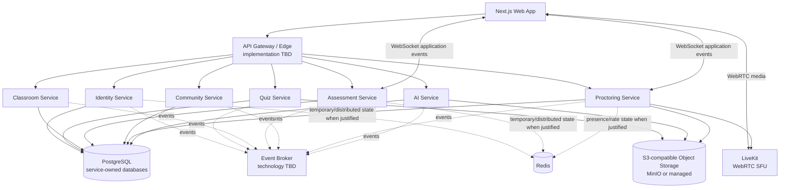

# System Architecture

Status: **Baseline v0.1**

## Architectural style

Quizopia 2.0 uses **coarse-grained microservices**.

The goal is not to maximize service count. Services are split where business ownership, scaling characteristics, security boundaries, or workloads justify it.

## Baseline topology

The drawing shows logical relationships, not mandatory deployment replicas.

## Service baseline

- Identity Service
- Quiz Service
- Classroom Service
- Assessment Service
- Community Service
- Proctoring Service
- AI Service

Do not split grading into its own service in the initial architecture. Assessment owns authoritative grading/result transactions.

Do not create a generic "File Service" by default. File metadata belongs to the business service that owns the file's purpose; binary content can live in object storage.

## Communication responsibilities

### REST/HTTP

Authoritative business commands and queries.

Examples:

- register/login;
- create/update quiz draft;
- publish version;
- start attempt;
- autosave answer;
- submit;
- create classroom;
- publish community post.

### WebSocket

Application realtime events.

Examples:

- teacher monitoring counters;
- attempt started/submitted;
- server-time sync;
- proctor events;
- presence/connection state.

### WebRTC

Realtime media only.

Examples:

- camera;
- optional microphone;
- future screen sharing.

## Core architectural invariant

An active assessment attempt must remain functional even if Quiz Service is unavailable.

Assessment Service therefore owns/persists the immutable delivery snapshot needed for the publication/attempt rather than fetching mutable quiz content question-by-question during an attempt.

## Legacy inheritance

The architecture intentionally carries forward proven concepts from Quizopia 1.x:

- immutable published snapshots;
- transactional attempt correctness;
- server-authoritative time;
- idempotent submit;
- sequence-aware autosave;
- after-commit realtime publication;
- database-enforced integrity.

It does not carry forward legacy service/module coupling as a requirement.
