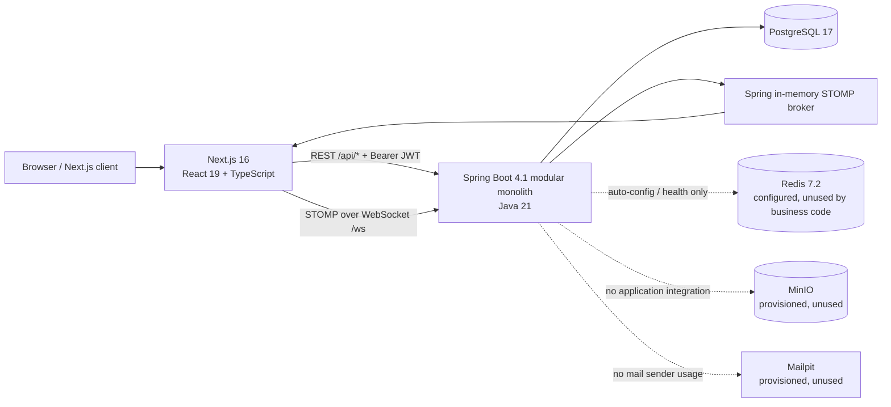
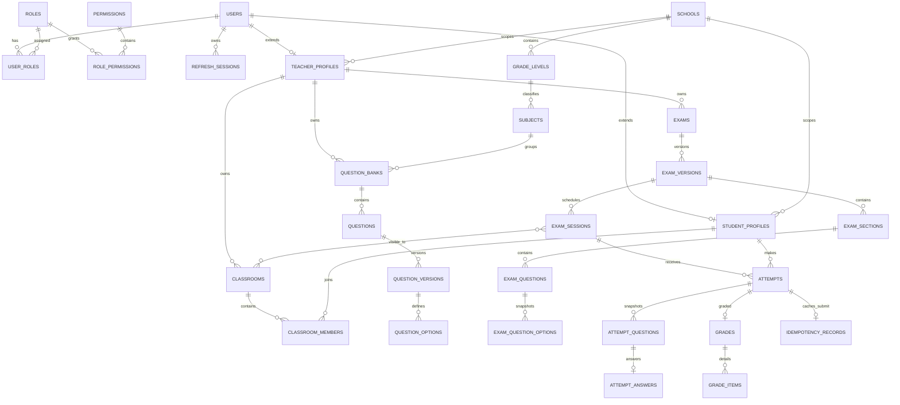
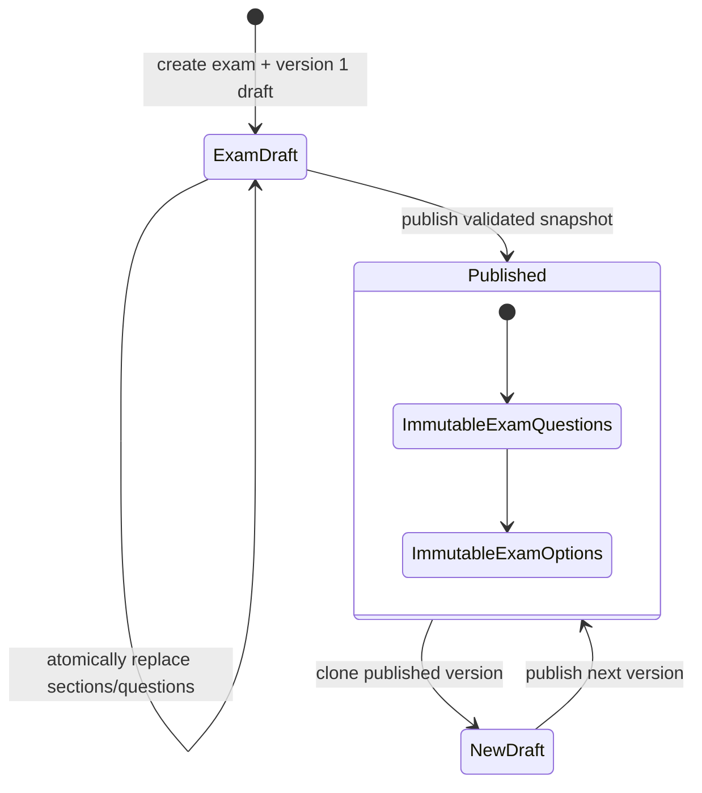
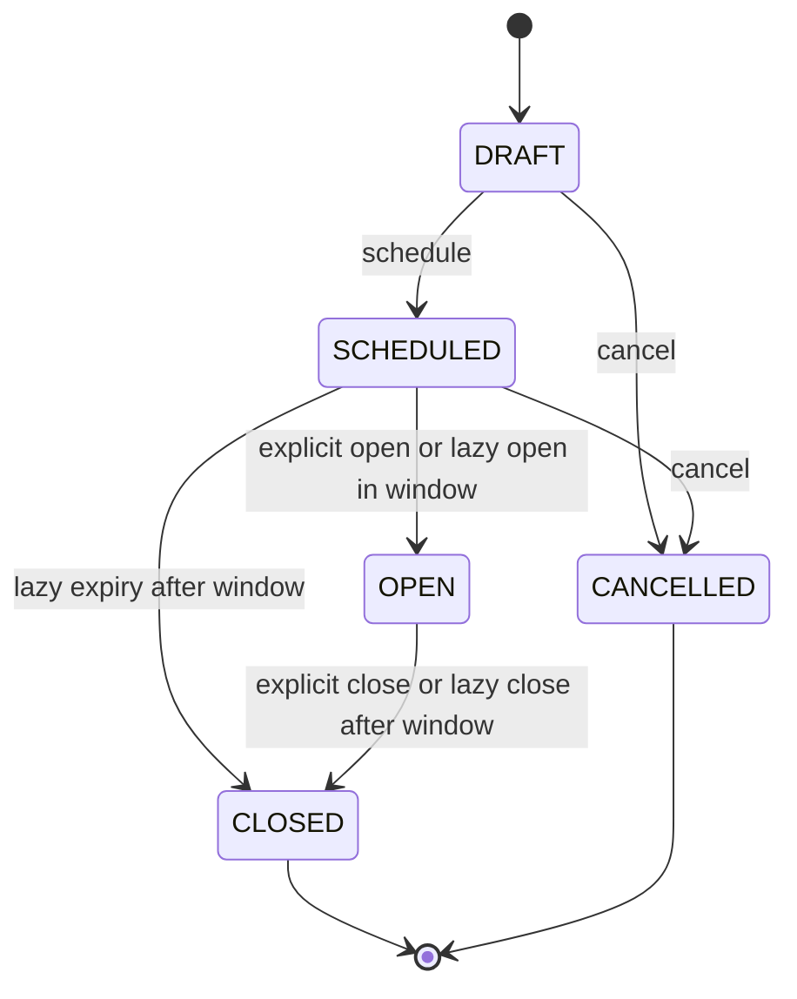
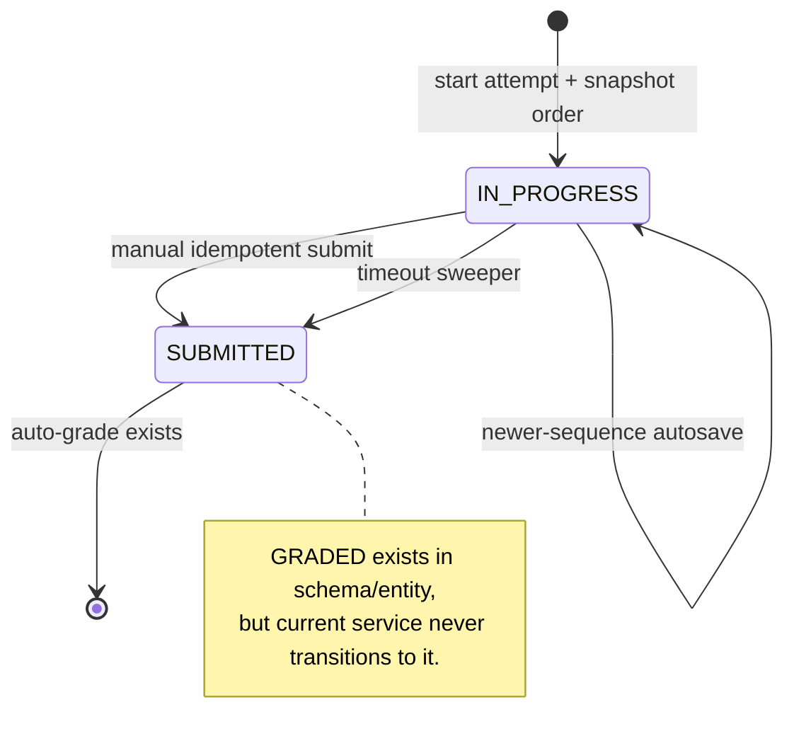

> **REFERENCE ONLY**
>
> This document describes Quizopia 1.x. Quizopia 2.0 specifications and accepted ADRs take precedence over legacy behavior.

# Legacy Quizopia Architecture Analysis

## Scope and method

This document analyzes the legacy repository at `../quizopia-system` as input to a clean-room rewrite of Quizopia 2.0. The analysis is based on the checked-out parent commit `7415650e1ba562ebac6181c6ce9544fda79c0ddb`, backend submodule commit `9a43e46b7ab786cfb600891e32def26d173584c4`, and frontend submodule commit `cb9db8387d21367727ecfbd048bf554fe5f4b4ec`.

The implementation, Flyway migrations, configuration, and tests were treated as authoritative. The legacy Markdown documentation was used only as supporting context because several documents describe an older intended architecture rather than the checked-in system. No files in `../quizopia-system` were modified and no build or test command was run there.

## Executive summary

Legacy Quizopia is a Spring Boot modular monolith with a Next.js client and PostgreSQL as its actual system of record. Its core product flow is well conceived: teachers maintain question banks, compose versioned exams, publish immutable exam snapshots, schedule sessions, and monitor students; students start or resume attempt snapshots, autosave answers, submit idempotently, and receive an automatically computed grade.

The best engineering is concentrated around correctness-sensitive boundaries:

- published exam content is copied into immutable snapshot tables;
- attempts snapshot stable question and option ordering;
- school/tenant consistency is enforced with composite foreign keys;
- autosave uses a sequence-guarded PostgreSQL UPSERT;
- submit, grading, and idempotency caching share one transaction;
- attempt start/submit events are dispatched only after commit;
- authentication uses short-lived access tokens and rotating opaque refresh tokens.

The biggest rewrite risks are inconsistencies introduced as the MVP evolved. Class-based session eligibility replaced explicit participants, but the participant schema, endpoints, UI, roster union, and some statistics remain. Question versions are described as immutable but the current version is edited in place. Grades have a release state that is never used, while students can immediately read auto-graded results. Session state is advanced lazily on unrelated reads, and bulk transitions do not emit realtime events. Redis, MinIO, mail, and OAuth dependencies are provisioned but unused by application code.

Quizopia 2.0 should preserve the domain boundaries and transactional invariants, while simplifying the model to one eligibility mechanism, one coherent grade/result lifecycle, explicit state-transition jobs, and infrastructure that exists only when the product uses it.

---

## 1. System architecture overview

### Runtime topology



The frontend is a browser-rendered Next.js App Router application. It does not use a Next.js backend-for-frontend layer or server actions for domain operations; client components call the Spring API directly through Axios. The access token is held in browser memory, while the refresh token is an HttpOnly cookie.

The backend is one deployable Spring Boot process organized into business packages. Controllers delegate to application services; services use Spring Data JPA repositories, `JdbcTemplate`, or `EntityManager`; Flyway exclusively owns the schema (`ddl-auto=validate`, open-session-in-view disabled). Cross-module collaboration is in-process and often directly reaches another module's repository.

PostgreSQL is the effective source of truth for identity, authorization, academic data, exams, attempts, grades, idempotency, and notifications. Realtime delivery uses Spring's single-process simple broker, not Redis Pub/Sub. Redis is configured and included in the dependency graph, but no cache, presence, rate-limit, or application Redis API appears in production code. MinIO and Mailpit are Docker-only placeholders.

### Architectural style

The backend is a **package-oriented modular monolith**, not a rigorously isolated modular monolith. Each domain normally has `api`, `application`, `domain/model`, `dto`, `repository`, and `exception` packages, which is a useful organizational convention. However, module boundaries are not enforced: attempt services import academic and exam repositories/entities, exam services import question repositories/entities, and reporting is implemented inside the attempt package with direct SQL across several schemas.

The system follows these main communication patterns:

1. REST commands and queries for all mutations and authoritative reads.
2. PostgreSQL transactions and constraints for correctness.
3. In-process Spring application events for session/attempt changes.
4. STOMP events as best-effort UI acceleration after REST commits.
5. TanStack Query for frontend server-state caching and Zustand for auth/attempt working state.

### Actual versus advertised architecture

The root README is broadly accurate about the core stack and core exam flow, but some claims exceed the implementation:

- Redis does not implement cache, rate limiting, or presence.
- MinIO is not integrated.
- Mail is not sent.
- notification WebSocket delivery is not consumable by the current STOMP authorization rules or frontend.
- multiple-choice grading is all-or-nothing, not partial credit; proportional credit is used for true/false matrix questions.
- result release policy is modeled but not enforced.
- session auto-open/close is access-triggered rather than driven by a dedicated scheduler.
- current Flyway history has 9 migrations and 33 tables, not the older counts in some documentation.

---

## 2. Backend module map

| Module           | Responsibility                                                                                                                                                       | Main entry points                                                                                                          | Important dependencies and observations                                                                                                                                                                        |
| ---------------- | -------------------------------------------------------------------------------------------------------------------------------------------------------------------- | -------------------------------------------------------------------------------------------------------------------------- | -------------------------------------------------------------------------------------------------------------------------------------------------------------------------------------------------------------- |
| `identity`       | Persistence model for users, roles, permissions, role assignments, and refresh sessions                                                                              | Repositories and entities only                                                                                             | Shared heavily by auth and every manual authorization service. No application facade protects the boundary.                                                                                                    |
| `authentication` | Registration, login, current-user lookup, refresh rotation, logout                                                                                                   | `AuthenticationController`; `RegistrationService`, `LoginService`, `RefreshService`, `LogoutService`, `CurrentUserService` | Uses `identity`, `security`, academic repositories, and notifications. Registration creates a role but intentionally does not create an academic profile.                                                      |
| `security`       | HTTP security chain, JWT encode/decode, authority conversion, password hashing, refresh token generation/hashing, PII encryption, CORS/origin checks, error handlers | `SecurityFilterChainConfig`, `QuizopiaJwtAuthenticationConverter`, token/password/encryption components                    | HTTP routes are mostly only `authenticated()`; fine-grained authorization is performed manually in services.                                                                                                   |
| `user`           | System-admin user CRUD, account status changes, role assignment, role catalog                                                                                        | `UserController`, `UserService`                                                                                            | Status/role mutations can invalidate access tokens through `token_version`. Uses notifications for status changes.                                                                                             |
| `academic`       | Schools, grade levels, subjects, teacher/student profiles, student onboarding, demo seeding                                                                          | `AcademicController`, `StudentOnboardingController`; `AcademicService`, `StudentOnboardingService`, `DemoDataSeeder`       | School is the tenant root. Onboarding identifies registered students by missing `student_profiles`, then assigns a school/code.                                                                                |
| `classroom`      | Teacher-owned classes and membership                                                                                                                                 | `ClassroomController`, `ClassroomService`                                                                                  | Class membership is the current attempt eligibility mechanism for restricted sessions.                                                                                                                         |
| `question`       | Question banks, questions/options, Excel template/import, question editing                                                                                           | `QuestionBankController`, `QuestionController`, `QuestionImportController`                                                 | Four types: single choice, multiple choice, true/false matrix, numeric fill. `QuestionVersion` is mutated in place despite being documented as immutable/versioned.                                            |
| `exam`           | Exam identity, draft/published versions, sections, snapshot composition, session creation and lifecycle, class assignment, legacy participant management             | `ExamController`, `ExamSessionController`, `ExamSessionParticipantController`, `ExamPurposeController`                     | `ExamService` and `ExamSessionService` are large orchestration services. Published exam questions/options are snapshots. Participant management is now semantically inconsistent with class-based eligibility. |
| `attempt`        | Available sessions, start/resume, attempt detail/history, autosave, submit, timeout sweep, results, statistics, Excel export                                         | Seven controllers and ten application services                                                                             | The most correctness-sensitive module. Mixes JPA and direct PostgreSQL SQL. Owns reporting despite it being a separate conceptual concern.                                                                     |
| `grading`        | Pure grading rules and grading orchestration                                                                                                                         | `Grader`, `AttemptGradingService`, `BestResultComparator`, export sanitization                                             | `Grader` is pure and testable. Orchestration joins the submit transaction and persists one grade plus per-question items.                                                                                      |
| `realtime`       | STOMP endpoint, CONNECT authentication, SUBSCRIBE authorization, client SEND denial, event envelopes, after-commit broadcasting, server-time sync                    | `WebSocketConfig`, interceptors, broadcaster, publisher                                                                    | Uses the in-memory simple broker. Carefully handles after-commit events and server-time subscription races, but only two subscription destinations are allowed.                                                |
| `notification`   | Persist/list/read in-app notifications and attempt best-effort push                                                                                                  | `NotificationController`, `NotificationService`                                                                            | Polling works. Push happens before the surrounding transaction commits and `/user/queue/notifications` is not allowed by `StompSubscribeInterceptor`.                                                          |
| `common`         | Generated readable business codes                                                                                                                                    | `BusinessCodes`                                                                                                            | Small shared utility only.                                                                                                                                                                                     |

### Layering pattern

Most modules follow this dependency direction:

```text
Controller -> Application service -> Domain entity / repository -> PostgreSQL
                              \-> DTO mapping
                              \-> other module repositories/services
                              \-> ApplicationEventPublisher / NotificationService
```

DTOs prevent JPA entities from being serialized directly, and exception enums provide stable public error codes. This is worth retaining. The weak point is that cross-module repository access and raw SQL make dependencies implicit and make independent extraction difficult.

### Backend scale and test posture

There are 144 Java test files, with substantial integration coverage for authentication concurrency, schema constraints, attempts, grading, authorization, and realtime behavior. The production code also contains several oversized classes: `ExamService` is about 948 lines, `AttemptService` 675, `ExamSessionService` 617, and `ExcelQuestionParser` 471. These classes mix policy, authorization, persistence strategy, mapping, and error translation.

---

## 3. Frontend module map

### Route modules

| Area    | Routes                                                                            | Purpose                                                                                                             |
| ------- | --------------------------------------------------------------------------------- | ------------------------------------------------------------------------------------------------------------------- |
| Public  | `/`, `/login`, `/register`                                                        | Landing/dashboard and authentication. `/` adapts to the current user's roles.                                       |
| Student | `/sessions`, `/attempts`, `/attempts/[attemptId]`, `/attempts/[attemptId]/result` | Discover eligible sessions, start/resume attempts, take an exam, and view results.                                  |
| Teacher | `/question-banks/*`, `/exams/*`, `/exam-sessions/*`, `/classes/*`                 | Question authoring/import, exam composition/versioning, session scheduling/monitoring/reporting, and class rosters. |
| Admin   | `/admin`, `/admin/users`, `/admin/subjects`, `/admin/pending-students`            | Role-specific system administration and academic onboarding.                                                        |

Route-group layouts apply `RequireAuth` client-side guards. The student group requires `STUDENT`; the teacher group accepts `TEACHER` or `ACADEMIC_ADMIN`; the admin segment accepts either admin role, with some pages adding narrower checks. These are UX guards only. A mismatch exists because the teacher backend services usually require an actual active `TEACHER` role and `TeacherProfile`, so an academic admin can enter teacher routes but is then denied by the API.

### Frontend code areas

| Area                                         | Responsibility                                                                  | Observations                                                                                                                                               |
| -------------------------------------------- | ------------------------------------------------------------------------------- | ---------------------------------------------------------------------------------------------------------------------------------------------------------- |
| `app/`                                       | App Router pages and layouts                                                    | Nearly all domain pages are client components. Several pages are 300-627 lines and combine data loading, form state, mutations, dialogs, and presentation. |
| `components/ui`                              | Local Button, Card, Input, Badge primitives                                     | Small reusable Shadcn-style primitives with CVA/Tailwind utilities.                                                                                        |
| `components/layout`                          | Header, sidebar, mobile navigation, footer, notification bell, shell            | `lib/navigation.tsx` is a useful single source for role-filtered navigation.                                                                               |
| `components/auth` and `components/providers` | Route UX guards, auth boot, Query client boot                                   | Silent refresh hydrates the browser session after mount. No server-side auth boundary exists.                                                              |
| `components/student`                         | Attempt shell, question-type renderers, result view                             | Full-screen attempt UI, local timer, flags, autosave indicators, and question navigation.                                                                  |
| `components/teacher`                         | Question editor/import, exam editor, class assignment, live monitor, reports    | Reusable feature components exist, but some remain large and tightly coupled to API DTOs.                                                                  |
| `lib/api`                                    | Typed REST clients and error normalization                                      | Clear per-domain API files; all paths directly target Spring `/api/*`. Types are manually duplicated from backend DTOs.                                    |
| `hooks/queries`                              | TanStack Query query/mutation wrappers and invalidation                         | Good separation of server-state coordination from pages. Query keys are hand-written and not fully centralized.                                            |
| `lib/auth`                                   | Zustand auth state, auth API, access-token injection, 401 single-flight refresh | Access token is memory-only; refresh cookie remains HttpOnly. Concurrent 401s share one refresh request.                                                   |
| `lib/attempt`                                | In-memory answer/flag state and per-question autosave                           | Sequence-aware saves handle edit-during-flight. State is not persisted locally; recovery depends on successful server autosave.                            |
| `lib/realtime`                               | STOMP client and React hooks                                                    | One raw-WebSocket client per mounted hook, 5-second reconnect, fresh access token on reconnect, teacher topic events, and student server-time sync.        |
| `lib/validation`                             | Zod schemas                                                                     | Duplicates backend validation but provides immediate UX feedback.                                                                                          |

### Frontend state architecture

- **Server state:** TanStack Query with 30-second default staleness, no automatic retry for API/HTTP failures, and one retry for a transient network failure.
- **Authentication state:** Zustand, memory only. `AuthProvider` silently calls refresh then `/me` on every full page load.
- **Attempt working state:** Zustand keyed by `attemptQuestionId`; answer entries track payload, server sequence, and dirty state. Flags are local-only.
- **Forms:** React Hook Form plus Zod.
- **Realtime state:** component-local React state seeded from REST and incrementally updated from STOMP events. REST is explicitly treated as authoritative after reconnect.

### Frontend testing gap

No first-party frontend `*.test.*` or `*.spec.*` files are present, despite significant correctness logic in refresh queueing, attempt autosave, timers, submit retry, and realtime metrics. This is a major imbalance against the strong backend test suite.

---

## 4. Database and domain model

Flyway migrations V1-V9 create 33 tables. PostgreSQL-specific features are deliberately used: JSONB, partial unique indexes, INET, UUID, window functions, check constraints, composite foreign keys, and `ON CONFLICT` UPSERT.

### Table groups

| Domain          | Tables                                                                                                                                              | Meaning                                                                                                 |
| --------------- | --------------------------------------------------------------------------------------------------------------------------------------------------- | ------------------------------------------------------------------------------------------------------- |
| Platform        | `platform_metadata`                                                                                                                                 | Small installation metadata catalog. It has no observed runtime role.                                   |
| Identity/RBAC   | `users`, `roles`, `permissions`, `user_roles`, `role_permissions`, `refresh_sessions`                                                               | Login identity, multiple expiring roles, fine-grained permissions, and refresh-token rotation families. |
| Academic        | `schools`, `grade_levels`, `subjects`, `teacher_profiles`, `student_profiles`                                                                       | School tenant root, school-scoped curriculum, and one-to-one academic profiles attached to users.       |
| Classroom       | `classrooms`, `classroom_members`, `exam_session_classes`                                                                                           | Teacher-owned class rosters and session-to-class visibility assignments.                                |
| Question bank   | `question_banks`, `questions`, `question_versions`, `question_options`                                                                              | Stable question identity plus content/options. Bank ownership, subject, and school scope are explicit.  |
| Exam            | `exam_purposes`, `exams`, `exam_versions`, `exam_sections`, `exam_questions`, `exam_question_options`, `exam_sessions`, `exam_session_participants` | Exam identity/version snapshots, session scheduling, and two competing eligibility representations.     |
| Attempt/grading | `attempts`, `attempt_questions`, `attempt_answers`, `grades`, `grade_items`, `idempotency_records`                                                  | Per-taking snapshot, sequence-aware answers, grading output, and immutable cached submit response.      |
| Notifications   | `notifications`                                                                                                                                     | Per-user persisted in-app notification feed.                                                            |

### Core relationship map



### Important invariants

1. **School isolation:** composite keys such as `(school_id, subject_id)`, `(school_id, teacher_profile_id)`, `(school_id, session_id)`, and `(school_id, student_profile_id)` prevent cross-school references even if application checks fail.
2. **Question provenance:** an exam question stores both `source_question_id` and `source_question_version_id`, with a composite FK proving that the version belongs to the question.
3. **Published version invariant:** a published exam version must have `published_at` and positive `total_points`; a draft must not have `published_at`.
4. **Single draft:** a partial unique index allows at most one draft version per exam.
5. **Session state/timestamp invariant:** DRAFT/SCHEDULED/CANCELLED have no open/close timestamps, OPEN has only `opened_at`, and CLOSED has both.
6. **Single active attempt:** a partial unique index allows at most one `IN_PROGRESS` attempt for a student/session, while a separate key controls numbered attempts.
7. **Attempt ownership:** composite foreign keys prevent answers and grade items from referencing a question belonging to another attempt.
8. **Submission invariant:** `submitted_at` and `submission_idempotency_key` are both absent for `IN_PROGRESS` and both present for `SUBMITTED`/`GRADED`.
9. **Autosave ordering:** one answer exists per attempt question; only a strictly larger `sequence_number` wins.
10. **Grade integrity:** one grade per attempt, one item per grade/question, capped scores, and a release timestamp/status equivalence.
11. **Submit idempotency:** one cached submit response per attempt and no reuse of the same user/operation/key across attempts.

### Domain model concerns

- `question_versions` is structurally versioned, but `QuestionService.editQuestion` mutates the current row instead of adding a version and advancing `current_version_number`.
- `attempts.GRADED` and `Attempt.markGraded()` exist but the grading flow leaves attempts `SUBMITTED`.
- `grades.RELEASED` and `Grade.release()` exist but no release endpoint/service is present; student result APIs do not require release.
- `exam_session_participants` remains fully modeled even though attempt eligibility uses class membership or public visibility.
- several enum/catalog concepts are ahead of product behavior: question-bank visibility is not used for cross-owner reads, archive permissions lack complete flows, and pass/fail statistics are null because no pass threshold exists.
- JSONB is appropriate for varying answer payloads and metadata, but validation is duplicated across SQL checks, Java validators, import parsing, exam publishing, and Zod schemas.

---

## 5. Authentication and authorization architecture

### Authentication flow

```mermaid
sequenceDiagram
    participant C as Browser
    participant A as Auth API
    participant DB as PostgreSQL

    C->>A: POST /api/auth/login (username/email + password)
    A->>DB: Load user; apply lockout; verify Argon2id hash
    A->>DB: Load active roles
    A->>DB: Insert hashed opaque refresh session
    A-->>C: JWT access token + HttpOnly refresh cookie

    C->>A: API request with Bearer access token
    A->>A: Verify HS256, exp, issuer, audience
    A->>DB: Reload user, token_version, active roles, permissions
    A-->>C: Authorized response or 401/403

    C->>A: POST /api/auth/refresh with cookie
    A->>DB: Pessimistically lock hashed refresh session
    A->>DB: Revoke old token; insert replacement in same family
    A-->>C: New access token + rotated refresh cookie
```

Key properties:

- Passwords use Argon2id, with timing equalization for unknown identifiers and lazy rehash when parameters change.
- Login lockout is five failures for 15 minutes by default.
- Access tokens are HS256 JWTs with 15-minute lifetime, issuer, audience, subject=user ID, username, role snapshot, token version, and JTI.
- The JWT role claim is not trusted for authorization. On every authenticated request, the converter reloads the user, active roles, and effective permissions from PostgreSQL and checks `token_version`.
- Refresh tokens are high-entropy opaque values. Only SHA-256 hashes are stored. Rotation is serialized with a pessimistic lock, retains the original seven-day family expiry, and detects reuse; reuse revokes all still-active tokens in the family.
- Refresh/logout are protected from CSRF by HttpOnly + SameSite=Lax plus an explicit Origin allowlist. The rest of the API is stateless Bearer authentication with CSRF disabled.
- Access tokens live only in frontend memory. The browser performs silent refresh on app boot and uses a single-flight Axios interceptor for concurrent expired-token responses.
- Phone data is encrypted with AES-256-GCM using an environment-provided key.

### Authorization model

The intended model is three layers:

1. RBAC permission.
2. Role/profile/tenant relationship (teacher or student profile, same school, ownership/class membership).
3. Resource state and time-window policy.

The database seeds four non-hierarchical roles: `SYSTEM_ADMIN`, `ACADEMIC_ADMIN`, `TEACHER`, and `STUDENT`, plus a broad fine-grained permission catalog. `user_roles` can expire. There is deliberately no implicit “admin has every permission” hierarchy.

The HTTP filter chain authenticates most domain routes but does not enforce their permissions. Application services query the role/permission tables again and implement deny-by-default logic manually. Exam and attempt modules have shared authorization helpers; other modules duplicate the pattern. Result/reporting services instead derive a single highest-precedence role with `EffectiveRoleResolver` and branch by role.

### Strengths

- Current database state, rather than stale JWT claims, controls authorization and revocation.
- Ownership and school scope are enforced server-side and often duplicated at the database level.
- Read endpoints sometimes use 404 anti-enumeration while writes use explicit 403.
- Refresh rotation/reuse behavior and concurrency are unusually well tested.
- WebSocket CONNECT reuses the same JWT decoder and converter as HTTP.

### Problems to resolve in 2.0

- Authorization policy is fragmented across services and raw SQL. There is no central policy vocabulary or consistent role-versus-permission strategy.
- `QuestionService.requireOwnedQuestion` checks `QUESTION_CREATE` for both GET and PUT rather than `QUESTION_READ`/`QUESTION_UPDATE`.
- Frontend role gates and backend capability rules disagree for academic admins on teacher routes.
- Registration comments say student accounts are PENDING, but `RegistrationService` does not set `User.status=PENDING`; “pending” is actually represented by the absence of a `student_profiles` row.
- Reloading user, roles, and permissions on every request provides immediate revocation but adds several database queries to all authenticated traffic. In 2.0 this should be an explicit security/performance choice, supported by a cache or a simpler capability snapshot if scale requires it.
- The token carries roles that the server explicitly treats as stale. Either document the claim as display-only or remove it.
- Public teacher registration depends on one global invite code, which is insufficient for production onboarding, school affiliation, expiry, auditing, or one-time use.
- No password reset, email verification, MFA, external identity-provider flow, session-management UI, or security audit log exists despite unused OAuth/mail dependencies.

---

## 6. Exam lifecycle

“Exam” has three related lifecycles: question content, exam versions, and scheduled sessions.

### Question and exam authoring



1. A teacher creates an exam tied to their school, subject, optional purpose, and teacher profile. The transaction also creates DRAFT version 1.
2. The teacher replaces the draft composition in one transaction. The request contains ordered sections and source question IDs. The service validates structure, checks ownership/school/subject/state, resolves each question's current version, and copies it into `exam_questions`/`exam_question_options` while retaining source provenance.
3. Publish pessimistically locks the exam, requires a single draft, validates nonempty sections and question-type shapes, rechecks that sources/banks remain active and owned, refreshes selected fields/options from the pinned source version, computes total points, changes the version to PUBLISHED, and marks the exam READY.
4. A later version can be created only when no draft exists. It deep-copies a selected/latest published version, preserving pinned source IDs, then follows the same draft/publish flow.
5. Published versions are not edited by application endpoints and sessions pin a published `exam_version_id`.

### Exam session state machine



A session pins one PUBLISHED exam version and defines code/title, start/end window, max attempts (`0` means unlimited), optional duration override (`null` inherits exam duration, `0` means no per-attempt limit), and visibility:

- `PUBLIC`: any active student profile in the same school can start.
- `CLASS_RESTRICTED`: the student must belong to at least one assigned class.

Teachers may update or replace class assignments only while DRAFT or SCHEDULED. Lifecycle actions are largely idempotent. Explicit open is allowed only inside the window; explicit close requires OPEN; cancel is allowed only before opening.

“Automatic” transitions are lazy:

- teacher session list bulk-opens due scheduled sessions and bulk-closes expired scheduled/open sessions;
- teacher detail opens/closes one session under lock and publishes an event;
- student start lazily opens a scheduled session in its window;
- no background scheduler advances session state independently of access.

Bulk list transitions do not publish session realtime events, so connected clients can temporarily disagree with PostgreSQL until a REST refresh.

---

## 7. Quiz attempt lifecycle



### Discover and start/resume

1. `GET /api/exam-sessions/available` queries same-school sessions that are SCHEDULED/OPEN and visible through PUBLIC or assigned-class membership. It calculates used/remaining attempts and whether start/resume appears possible.
2. Starting requires an active STUDENT role, permission, and active student profile.
3. The service pessimistically locks the session, rechecks eligibility, lazily opens it when due, validates the time window, and looks for an active attempt.
4. An existing nonexpired active attempt is returned as a resume. An expired active attempt is rejected until the server sweeper finalizes it.
5. A new attempt number is calculated under the session lock. Deadline is `min(session.endsAt, startedAt + effectiveDuration)`; zero duration means session end only.
6. The attempt and ordered `attempt_questions` are created atomically. Attempt questions reference immutable exam snapshot rows and persist option-key order. Student DTOs omit correctness, answer keys, and explanations.
7. After commit, `ATTEMPT_STARTED` and a recomputed active-count event are sent to the teacher topic.

### Autosave

1. The frontend stores answers by `attemptQuestionId`, marks edits dirty, and debounces each question for 1.5 seconds. Only one request per question may be in flight.
2. The request supplies an answer payload and a monotonically increasing sequence number.
3. The backend locks the attempt, checks owner/school/state/deadline, resolves an attempt-owned question, validates and canonicalizes the payload against its type and option order, then performs an atomic PostgreSQL UPSERT.
4. A sequence greater than the stored value wins. A stale request receives `accepted=false` plus the actual current sequence, allowing the client to recover without treating reordering as an error.
5. The client only clears dirty state when the answer did not change while the request was in flight.

### Submit and grade

1. The frontend generates one UUID-like idempotency key per submit intent and retains it for a network retry. Manual submit is disabled while answers are dirty/saving.
2. The backend locks the attempt and verifies owner, state, key format, deadline, and cross-attempt key reuse.
3. A same-key retry of an already submitted attempt returns the previously stored JSON response without recomputing or mutating anything. A different key is rejected.
4. First submit changes the attempt to SUBMITTED, grades all questions, inserts one grade and per-question grade items, stores the serialized success response in `idempotency_records`, and flushes all constraints in one transaction. A grading or idempotency failure rolls back everything.
5. After commit, the teacher receives `ATTEMPT_SUBMITTED` plus a new active count. A persisted result notification is also created.
6. The grading rules are: single choice exact match; multiple choice exact set match; true/false matrix proportional by correct statements; numeric fill exact string match (`"1.00"` differs from `"1"`). All score arithmetic uses `BigDecimal`.
7. Best-result selection is deterministic: percentage descending, score descending, submission time ascending, attempt ID ascending.

### Timeout handling

The client attempts a best-effort final flush at timer zero, then submits. Because the server strictly rejects saves/submits after the deadline, network latency makes this path inherently racy. A server scheduler runs every 30 seconds, locks each expired `IN_PROGRESS` attempt, records submission at the exact deadline, grades it, and emits the same realtime/result notification behavior. It does not create an idempotency cache row because its generated timeout key is not exposed to a client.

### Result handling

Students can read any own submitted grade immediately; teachers can read results for sessions they own; admin roles are broadly allowed in result services. Reports select one best result per student with PostgreSQL window functions and can export a multi-sheet workbook with formula-injection sanitization.

The modeled release lifecycle is not active. `GradeStatus.AUTO_GRADED` is returned directly to students, no release endpoint calls `Grade.release`, and attempt status remains SUBMITTED despite a persisted grade.

---

## 8. Realtime/WebSocket architecture

### Connection and authorization

- Endpoint: raw WebSocket `/ws`, STOMP protocol, no SockJS.
- Browser derives `ws://` or `wss://` from `NEXT_PUBLIC_API_URL`.
- Every STOMP CONNECT carries `Authorization: Bearer <access token>` in a native header. Tokens are never placed in the URL.
- The server uses the same JWT decoder and database-backed authentication converter as REST.
- All client SEND/MESSAGE frames are rejected. WebSocket is server-to-client only; commands remain REST.
- Allowed subscriptions are exactly:
  - `/user/queue/attempt` for any authenticated connection;
  - `/topic/exam-sessions/{sessionId}` for an active teacher with monitor permission who owns that same-school session.
- Every other destination is denied generically.

### Event model

The shared envelope contains `eventId`, `eventType`, `occurredAt`, `serverTime`, and only the identifiers/count appropriate to the event. It deliberately excludes answer payloads, correctness, grades, usernames, email, user ID, school ID, idempotency keys, and client instance IDs.

Events are:

- `SESSION_OPENED`
- `SESSION_CLOSED`
- `ATTEMPT_STARTED`
- `ATTEMPT_SUBMITTED`
- `ACTIVE_COUNT_CHANGED`
- `SERVER_TIME_SYNC`

Attempt and explicit/single-record session events are published inside their database transaction and handled by `@TransactionalEventListener(AFTER_COMMIT)`. Attempt active count is recomputed from committed PostgreSQL state in a new read-only transaction. Messaging failures are isolated from the already committed REST operation.

Server-time sync is sent only after the simple broker has registered the personal subscription. The implementation uses a broker-channel interceptor and direct WebSocket-session routing to avoid both a subscription-registration race and fan-out to another connection owned by the same principal. A bounded concurrent dedup set is cleaned on unsubscribe/disconnect.

### Frontend consumption

- The student attempt page subscribes to `/user/queue/attempt`, uses the server time to anchor its countdown, and invalidates attempt REST state after reconnect.
- The teacher monitor subscribes to the session topic, seeds metrics from REST, applies incremental events, and invalidates REST data after reconnect.
- STOMP reconnects after five seconds and obtains the latest in-memory access token before each CONNECT.

### Limitations

- The simple broker and in-memory subscription registry restrict the backend to one realtime instance. Redis is not used to distribute events or presence.
- There is no outbox, durable broker, delivery acknowledgment, replay, or event sequence. Events can be lost after commit or while a client is disconnected; REST reconciliation is mandatory.
- Bulk lazy session transitions emit no events.
- `NotificationService` sends to `/user/queue/notifications`, but the subscription interceptor denies that destination and the frontend never subscribes to it. The notification UI polls REST every 30/60 seconds instead.
- Notification push occurs immediately after `saveAndFlush`, not after the outer transaction commits, so a rollback can produce a ghost push.
- A STOMP connection is created per mounted hook rather than through one application-level connection/provider, increasing connections and duplicated lifecycle code as realtime features grow.

---

## 9. Infrastructure architecture

### Docker Compose topology

| Service        | Image/build                                                          | Ports     | Persistence                 | Actual application use                                                 |
| -------------- | -------------------------------------------------------------------- | --------- | --------------------------- | ---------------------------------------------------------------------- |
| `frontend`     | Multi-stage Node 22 Alpine build; non-root Next.js standalone runner | 3000      | none                        | Active. API URL is embedded at build time.                             |
| `backend`      | Multi-stage Maven/Temurin 21 build; non-root JRE Alpine runner       | 8080      | none                        | Active. Depends on PostgreSQL health and Redis start.                  |
| `postgres-db`  | PostgreSQL 17                                                        | 5432      | `postgres_data`             | Active source of truth. Has a health check.                            |
| `redis-cache`  | Redis 7.2 Alpine with password                                       | 6379      | `redis_data`                | Configured dependency/health contributor, but unused by business code. |
| `minio`        | `minio/minio:latest`                                                 | 9000/9001 | `minio_data`                | No backend S3 dependency/configuration or feature uses it.             |
| `mailpit`      | `axllent/mailpit:latest`                                             | 8025/1025 | none                        | No `MailSender` usage.                                                 |
| `backend-test` | Maven 3.9/Temurin 21 profile                                         | n/a       | Maven cache + Docker socket | Runs backend tests with Testcontainers.                                |

### Deployment properties

- All services share one Docker bridge network.
- PostgreSQL and Redis have hard-coded development credentials in Compose.
- Secrets for JWT, data encryption, and teacher invite code are expected from a local `.env`; missing values make key components fail fast.
- CORS origins and refresh-cookie `Secure` are environment-configurable.
- Frontend `NEXT_PUBLIC_API_URL` must be browser-reachable and is baked into the client bundle at build time.
- Only Actuator health is exposed; details require authentication.
- No reverse proxy, TLS termination, production profiles, secrets manager, backup/restore, migrations job, horizontal scaling design, centralized logs, metrics/tracing, alerting, or CI deployment architecture is present.
- Database, Redis, MinIO, and mail ports are published to the host, which is convenient for local development but should not be the production default.

### Infrastructure recommendation for 2.0

Begin with only frontend, backend, and PostgreSQL unless a requirement justifies another service. Add Redis when there is a concrete distributed cache/rate-limit/realtime requirement; add object storage only with a file/media feature; add SMTP only with a verified email flow. For production, place frontend/backend behind one TLS origin or reverse proxy, use relative `/api` and `/ws` URLs, keep data services private, and introduce health/readiness, backups, secret management, and observability as first-class deployment concerns.

---

## 10. Strong design decisions worth preserving

1. **PostgreSQL-backed modular monolith for the current scale.** The domain needs strong transactions more than distributed services. Preserve one deployable backend until independent scaling or ownership creates a real split point.
2. **Stable identity plus immutable published snapshots.** Preserve the separation among reusable question content, published exam content, and per-attempt order. It guarantees historical grading even after authors edit a bank.
3. **Database-enforced tenant and ownership consistency.** Composite same-school foreign keys are stronger than relying only on service checks and should remain.
4. **Explicit state machines with database checks.** Exam version, session, attempt, refresh, and grade invariants should be representable and validated in both domain code and schema.
5. **Transactional submit + grade + cached response.** This is the strongest workflow in the project. A successful response always corresponds to one durable submission and grade.
6. **Idempotency as a stored contract, not a boolean flag.** Returning the original serialized success response for the same key is robust under client retries.
7. **Sequence-aware autosave.** Server-side monotonic sequence comparison prevents delayed requests from overwriting newer answers.
8. **Purposeful pessimistic locking and documented lock order.** Session lock for start and attempt lock for autosave/submit are clear concurrency boundaries, backed by unique constraints.
9. **Server-authoritative deadlines.** The client timer is UX only; persisted deadlines and server clock decide whether writes are valid.
10. **Pure grading core with exact decimal arithmetic.** Keeping rule evaluation free of Spring/DB concerns makes it easy to test and audit.
11. **No answer leakage.** Student DTOs and realtime envelopes intentionally exclude correctness and answer keys. Structural tests reinforce this.
12. **After-commit realtime for authoritative state changes.** Realtime should never announce a rolled-back mutation and should never make a committed REST call fail.
13. **REST reconciliation after reconnect.** Treat events as hints and the database/API as truth unless a durable event architecture is deliberately introduced.
14. **Refresh-token family rotation and reuse detection.** The current flow, fixed family lifetime, hashing, lock, and concurrency tests are a solid security baseline.
15. **Memory-only access token plus HttpOnly refresh cookie.** This limits long-lived token exposure to JavaScript while retaining SPA usability.
16. **Stable public error codes and DTO boundaries.** Keep internal exceptions, SQL, entities, and secrets out of API responses.
17. **Flyway-owned schema and `ddl-auto=validate`.** Production schema changes should remain explicit and reviewable.
18. **Backend integration testing with real PostgreSQL/Testcontainers and injectable clocks.** The concurrency and state invariants need real-database tests, not only mocks.
19. **TanStack Query for server state and small local stores for working state.** The split is conceptually sound.
20. **Excel formula-injection defense.** Preserve cell sanitization in every export path.

---

## 11. Technical debt and decisions that should not be carried forward

### Highest-priority domain corrections

1. **Do not retain two eligibility models.** `exam_session_participants` is described as dead for start authorization, yet its endpoints and frontend hooks still operate, roster queries union participants with classes, and statistics count eligible participants from it. Choose class assignment, explicit invitation, or a unified audience model and use it consistently for visibility, start authorization, roster, notifications, and reporting.
2. **Do not retain the current grade/attempt status split.** Automatic grading persists a grade but never calls `Attempt.markGraded`; result release exists only in entity/schema comments and is not enforced. Define one state machine, for example `IN_PROGRESS -> SUBMITTED -> GRADED -> RELEASED`, or explicitly state that automatic grades are immediately released and remove unused states.
3. **Do not call mutable rows “versions.”** Editing a `QuestionVersion` in place undermines auditability and means a draft's pinned source row can change before publish. Create a new immutable question version on every edit and move the stable question pointer.
4. **Do not hide session scheduling inside read paths.** Reads that open/close sessions make state changes dependent on traffic, complicate caching, and create missing events. Use an explicit scheduler/job with idempotent transitions and after-commit events; reads may calculate an effective view but should not be the primary state engine.
5. **Do not preserve contradictory grading rules.** The database stores a fixed true/false scoring ladder that the grader ignores; the README advertises multiple-choice partial credit while the grader uses exact-set all-or-nothing. Put scoring policy in one versioned domain object and test it end-to-end.
6. **Remove the four-character numeric-answer constraint.** Requiring `expectedAnswer.length() == 4` is arbitrary, appears in SQL and Java, and rejects normal values such as `2`, `10`, or `3.14`. Define numeric normalization, scale, tolerance, units, and rounding explicitly.

### Authorization and security debt

7. **Centralize capability policies.** Manual role/permission/profile checks are copied across modules and already contain a wrong-permission bug in question reads/updates. Use typed policy services or method-security expressions backed by a consistent current-principal abstraction.
8. **Align frontend navigation with backend capabilities.** Do not let academic admins into teacher pages that require a teacher profile, and do not assume role alone implies every screen action. Render from capabilities or expose a role-to-route contract.
9. **Clarify onboarding state.** A registered student is currently ACTIVE as a user but “pending” because no academic profile exists. Use an explicit onboarding state or document this composition; do not leave comments and API status semantics contradictory.
10. **Replace the global teacher invite code.** Use school-scoped, expiring, one-time invitations with issuer, intended role, usage, and audit records.
11. **Make per-request authorization database cost deliberate.** Immediate revocation is valuable, but multiple identity queries on every request should be measured and consolidated. Do not accidentally depend on unused Redis to solve it later.
12. **Add missing account lifecycle controls.** Production needs password reset, verified email ownership, refresh-session visibility/revocation, audit logging, and likely MFA or OIDC depending on requirements.

### Backend design debt

13. **Enforce real module boundaries.** Domain services should not import other modules' repositories or build cross-domain SQL freely. Define application ports/read models, and add architecture tests (for example ArchUnit) so boundaries are executable.
14. **Break up orchestration god classes.** Separate policy/validation, command handlers, snapshot builders, persistence adapters, query projections, and DTO mapping. Large services currently make unrelated changes collide.
15. **Do not mix three persistence styles casually.** JPA, `JdbcTemplate`, and `EntityManager` are each useful, but each aggregate/workflow should have an intentional repository abstraction rather than leaking SQL throughout services.
16. **Use one injected clock everywhere.** Some security/attempt code correctly injects `Clock`, while exam/session code and some entities use `Instant.now()` directly. All business time must come from a clock abstraction.
17. **Fix notification transaction semantics.** Persist notification intent in the business transaction and publish after commit, ideally through an outbox if delivery matters. Do not push before commit.
18. **Remove catalog states and permissions without implemented behavior.** A large 84-permission catalog, unused archive/release concepts, and unconsumed notification types add false complexity. Seed only supported capabilities, then migrate as features appear.
19. **Do not keep indefinite idempotency rows by accident.** `expires_at` is constrained to null forever. Define retention/audit requirements and a safe pruning strategy, or explicitly accept permanent records.
20. **Do not rely on driver/constraint-name introspection as the primary domain conflict API.** Preserve unique constraints, but wrap persistence exceptions in a focused adapter and test against supported database versions.

### Realtime debt

21. **Do not claim realtime notifications until the route is authorized and consumed.** Current notification push targets a destination clients cannot subscribe to.
22. **Do not horizontally scale the simple broker.** If 2.0 needs multiple backend instances, introduce a broker/Redis relay or a dedicated gateway, plus cross-instance user/session routing.
23. **Add ordering/reconciliation semantics.** Current event UUIDs do not provide order or replay. Include an aggregate revision/sequence and make clients refetch on gaps.
24. **Use one frontend STOMP connection.** A provider should own authentication, reconnect, subscription multiplexing, and lifecycle for the whole app.
25. **Make session transition events complete.** Bulk scheduler transitions and all equivalent paths must publish the same after-commit event contract.

### Frontend debt

26. **Split large route components.** Pages should orchestrate feature components/hooks rather than contain tables, dialogs, schemas, error mapping, and business flows in one file.
27. **Add frontend tests before preserving the implementation.** Highest priority: refresh single-flight, role/capability routing, autosave sequence/edit-during-flight, deadline flush/submit, idempotency-key reuse, realtime reconnection, and result visibility.
28. **Generate or share API contracts.** Hand-maintained TypeScript DTOs and validation rules drift from Java and SQL. Generate from OpenAPI or a contract schema while retaining frontend-specific UX validation.
29. **Avoid build-time absolute browser URLs where one-origin deployment is possible.** Proxy `/api` and `/ws` through the deployment edge to simplify CORS, cookies, environments, and WebSocket URL derivation.
30. **Treat anti-cheating browser controls honestly.** Disabling context menus or hiding scrollbars does not secure an exam. Use them only as UX choices, not security claims.

### Infrastructure and documentation debt

31. **Remove unused Redis, MinIO, Mailpit, OAuth, and mail dependencies until needed.** Every service adds patching, secrets, health behavior, and operational failure modes.
32. **Do not expose data-service ports or hard-code credentials in production configuration.** Keep Compose clearly development-only and provide separate deploy manifests/profiles.
33. **Pin all production image versions.** `minio/minio:latest` makes builds nondeterministic.
34. **Add operational architecture.** Backups, recovery tests, readiness, migrations rollout, metrics, tracing, structured logs, alerts, and secret rotation are absent.
35. **Replace stale aspirational docs with generated/current contracts.** `docs/api.md` still documents `/api/v1`, courses/semesters, cookie-based access JWTs, WebSocket query tokens, and rate limits that do not exist. `docs/architecture.md` lists modules and boundaries that the code does not implement. Documentation should carry a version/commit and be checked in CI.

---

## 12. Components that are good candidates for code reuse

“Clean-room rewrite” normally means reimplementing behavior from a specification without copying implementation source. If that strict meaning applies, the items below are candidates to preserve as **behavioral specifications and test cases**, not source files. If source reuse is permitted because ownership/licensing is clear, use the risk categories below.

### Strong direct-reuse candidates after focused review

| Component                                                                      | Why it is reusable                                                 | Required review/change                                                                                             |
| ------------------------------------------------------------------------------ | ------------------------------------------------------------------ | ------------------------------------------------------------------------------------------------------------------ |
| `grading/Grader` and grading value records                                     | Pure, deterministic, framework-free, BigDecimal-only               | First finalize the intended partial-credit, matrix, and numeric policies; current code contradicts schema/docs.    |
| `grading/BestResultComparator`                                                 | Small deterministic ranking policy shared by Java and SQL behavior | Preserve only if “best attempt” rules remain unchanged.                                                            |
| `grading/ExcelCellSanitizer`                                                   | Isolated security utility                                          | Add property/fuzz tests for all spreadsheet formula prefixes and whitespace/control characters.                    |
| password, refresh-token generator/hasher, and AES-GCM components in `security` | Narrow interfaces and security-focused unit tests                  | Revalidate parameters, key rotation/versioning, and current library recommendations. Avoid copying secrets/config. |
| API error envelope/writers and frontend error normalizer                       | Stable codes and sanitized failure behavior are valuable           | Consolidate handler duplication and generate the error-code contract.                                              |
| `AnswerPayloadValidator`                                                       | Central type-specific server validation/canonicalization           | Make it consume the new canonical question/scoring schema.                                                         |
| Excel question parser/template logic                                           | Large amount of edge-case handling and row-level errors            | Isolate from current four-character numeric rule and add resource limits/fuzzing.                                  |
| frontend UI primitives and `cn` utility                                        | Small, local, visually consistent, low domain coupling             | Add accessibility tests and decide whether the 2.0 design system stays the same.                                   |
| frontend Axios error normalization and single-flight refresh pattern           | Correct handling of concurrent 401s and retry loops                | Package as a tested auth client and ensure interceptor lifecycle works under SSR/test isolation.                   |
| frontend answer store's sequence/edit-during-flight logic                      | Encodes an important client concurrency invariant                  | Add tests, a formal flush API, offline/error policy, and attempt-scoped store instances.                           |
| Testcontainers support, mutable clock, auth scenarios, realtime probes         | High-value verification infrastructure                             | Port early and rewrite fixtures around the new schema/API.                                                         |

### Reuse as design/reference, not wholesale code

- Flyway constraints for same-school composite foreign keys, single active attempt, answer ownership, grade ownership, and idempotency uniqueness.
- Refresh rotation and reuse-detection workflow, including its concurrency tests.
- Exam publish snapshot and attempt snapshot behavior.
- Submit transaction and immutable cached-response semantics.
- After-commit realtime event pattern and the server-time subscription-race tests.
- Teacher report SQL patterns using window functions for deterministic best-result selection.
- Excel export workbook structure and formula-injection tests.
- TanStack Query hook organization and role-filtered navigation model.
- Visual design tokens, typography, and local component conventions if the product identity remains desired.

These implementations are too coupled to reuse without redesign: `ExamService`, `ExamSessionService`, `AttemptService`, `QuestionBankService`, `ClassroomService`, large route pages, `NotificationService`, and the current realtime hook set.

### Do not reuse

- `exam_session_participants` schema/services/hooks as currently designed.
- mutable `QuestionVersion` edit behavior.
- unused `GRADED`/`RELEASED` lifecycle fragments without a new state specification.
- the four-character numeric answer rule or fixed-but-ignored matrix ladder.
- Docker Compose as a production architecture.
- stale legacy Markdown API/architecture documentation as a contract.
- demo data seeding beyond local fixtures.
- hard-coded development credentials or any local `.env` content.

### Recommended clean-room extraction package

Before implementing 2.0, translate the reusable behavior into implementation-neutral artifacts:

1. state-transition tables for exam versions, sessions, attempts, grades, and refresh sessions;
2. authorization decision tables for every command/query;
3. an OpenAPI contract plus stable error catalog;
4. database invariants expressed as acceptance tests;
5. concurrency scenarios for start, autosave, submit, refresh, and timeout;
6. grading examples for every question/scoring type;
7. realtime event schemas, ordering rules, and reconciliation behavior;
8. migration rules for any legacy data that must be imported, kept separate from 2.0 runtime code.

That package preserves the legacy system's strongest knowledge while allowing Quizopia 2.0 to be a genuinely cleaner implementation rather than a structural copy.

---

## Primary legacy evidence reviewed

- Root: `README.md`, `docker-compose.yml`, `.env.example`.
- Backend configuration: `backend/pom.xml`, `backend/Dockerfile`, `backend/src/main/resources/application.properties`.
- Database: all migrations under `backend/src/main/resources/db/migration/`.
- Backend production packages under `backend/src/main/java/com/quizopia/backend/`.
- Backend test inventory under `backend/src/test/java/com/quizopia/backend/`.
- Frontend configuration: `frontend/package.json`, `frontend/Dockerfile`, `frontend/next.config.ts`.
- Frontend routes, components, hooks, and libraries under `frontend/app/`, `frontend/components/`, `frontend/hooks/`, and `frontend/lib/`.
- Legacy documentation under `docs/`, used cautiously where it matches source.
