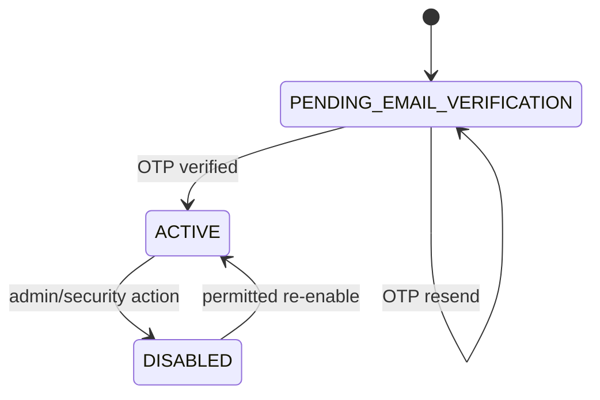
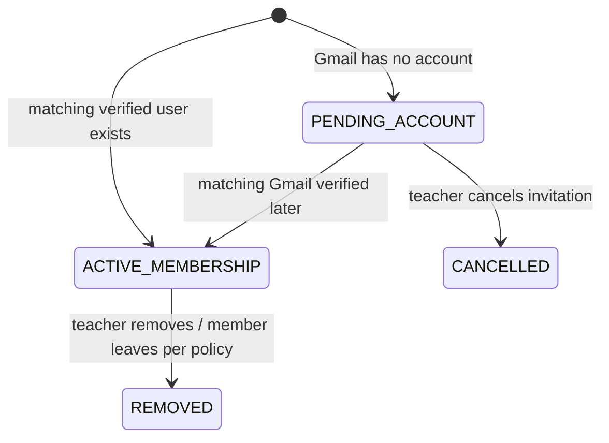
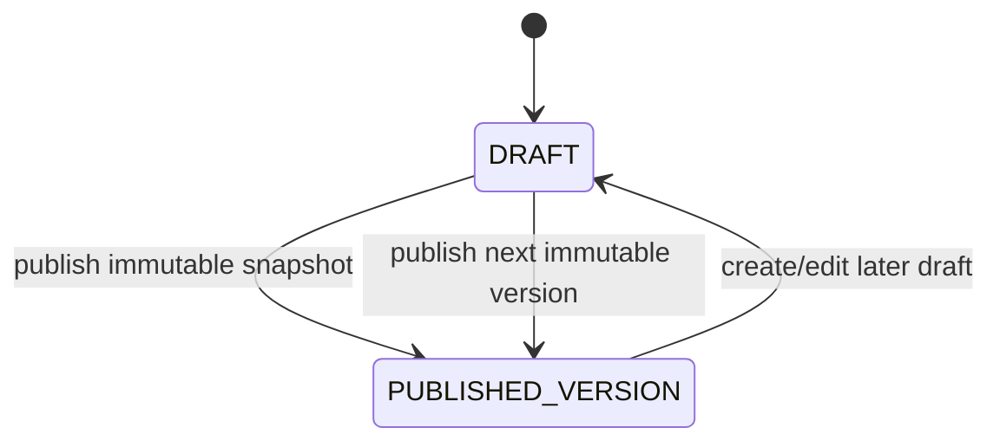
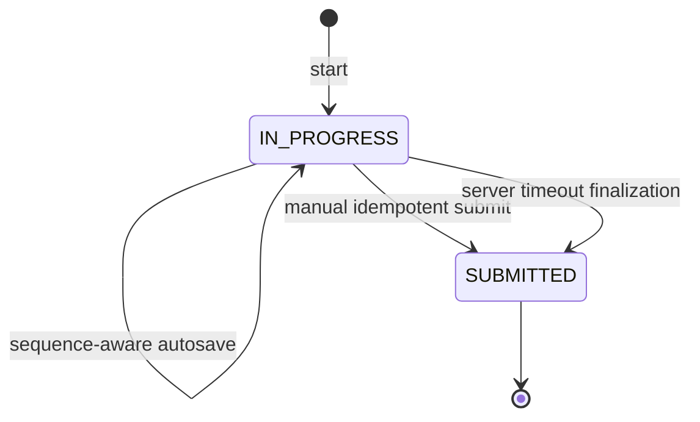
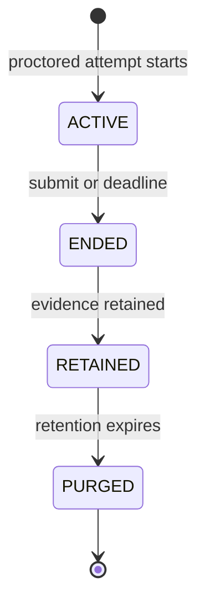
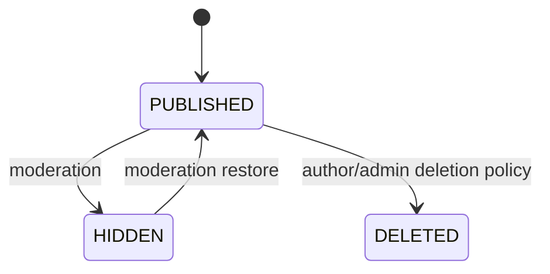

# State Machines

Status: **Baseline v0.1 with explicit TBD sections**

## User registration

Account lockout/session states may be modeled separately.

## Classroom manual invitation

Join-code approval states are TBD.

## Quiz content

Conceptual lifecycle:

A published version itself is immutable; the arrow back to DRAFT represents creation of a later draft, not mutation of the published row.

## Publication

The exact persisted publication status enum is **TBD**.

Required conceptual phases:

- configuration/draft;
- published/shareable;
- effective availability determined by policy/time;
- archived/disabled.

Do not create read-triggered hidden state transitions like the legacy session lifecycle.

If explicit scheduled opening/closing states are used, transitions should be driven by explicit commands/jobs and be idempotent.

## Assessment attempt

Baseline:

Automatic grading/result persistence occurs coherently with submission.

Do not add unused `GRADED`/`RELEASED` states unless a real separate lifecycle requires them.

Result visibility is controlled by publication policy rather than by placeholder states with no behavior.

## Proctoring session

Exact storage-cleanup retry states are implementation details.

## Community post

Baseline conceptual lifecycle:

Draft-post behavior is TBD.
