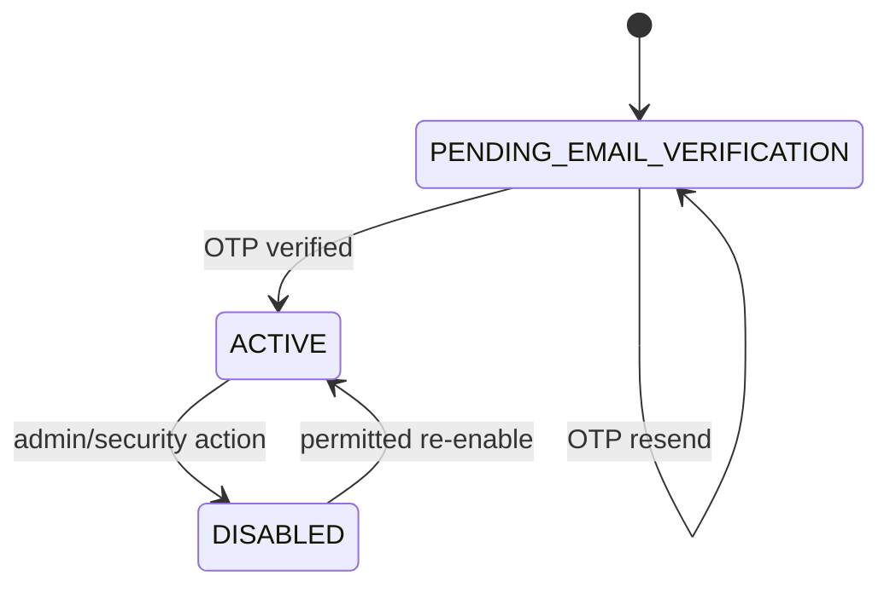
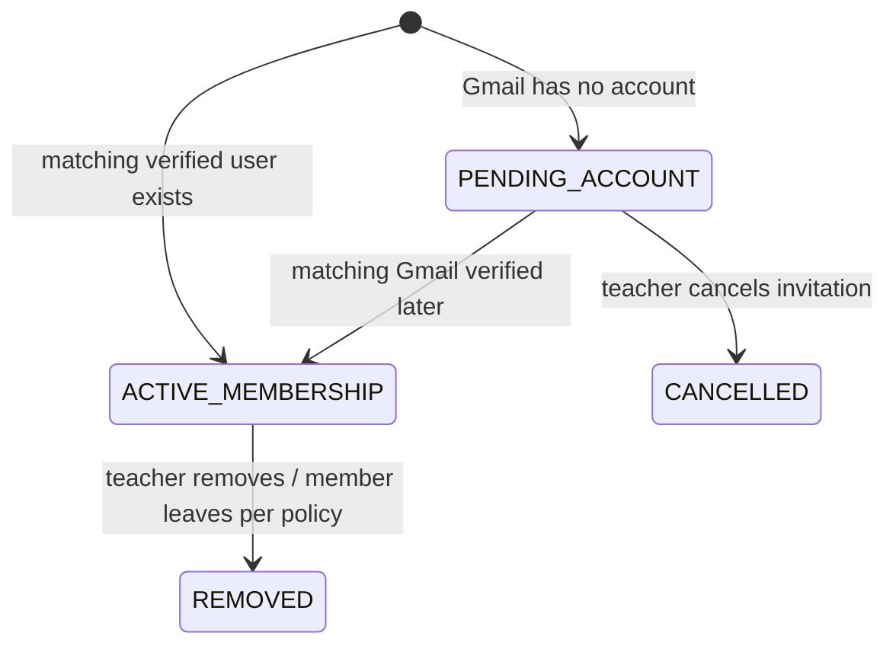
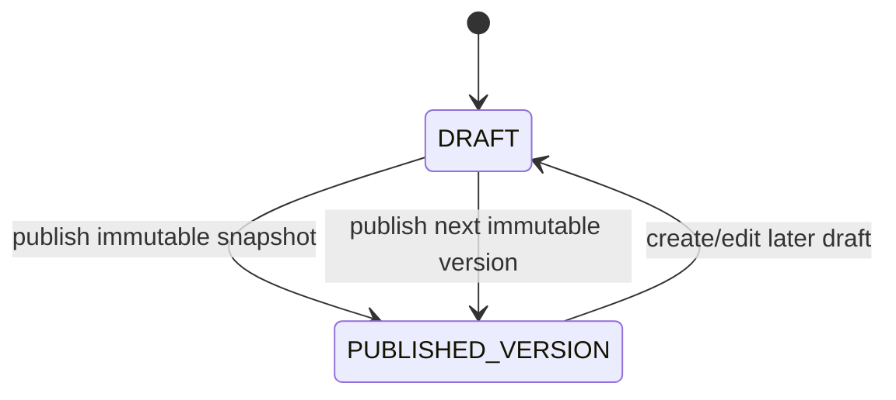
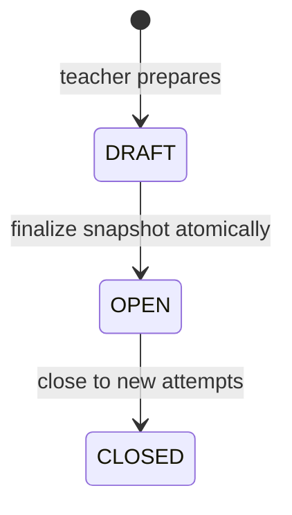
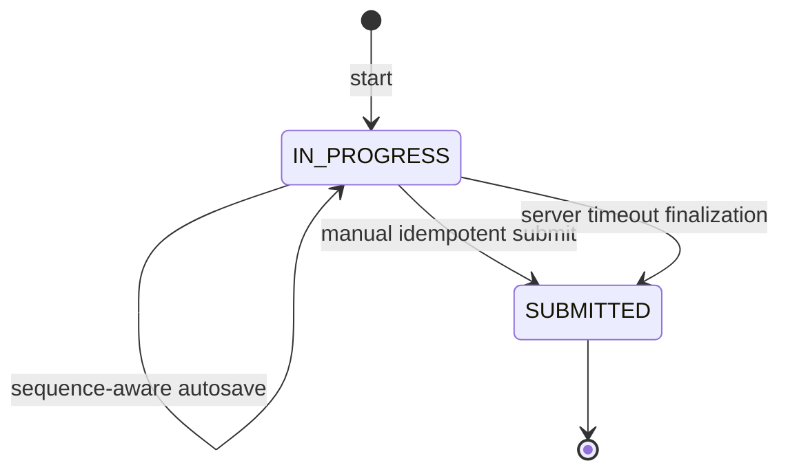
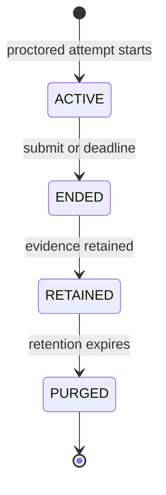
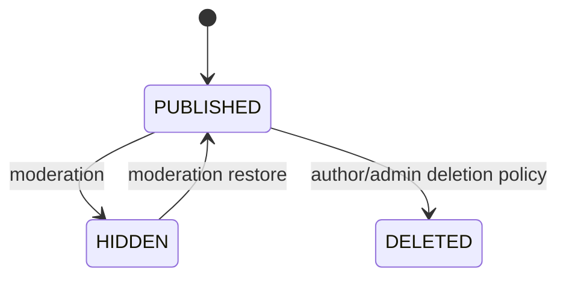

# State Machines

Status: **Baseline v0.1 with explicit TBD sections**

## User registration

```mermaid
stateDiagram-v2
    [*] --> PENDING_EMAIL_VERIFICATION
    PENDING_EMAIL_VERIFICATION --> ACTIVE: OTP verified
    PENDING_EMAIL_VERIFICATION --> PENDING_EMAIL_VERIFICATION: OTP resend
    ACTIVE --> DISABLED: admin/security action
    DISABLED --> ACTIVE: permitted re-enable
```

Account lockout/session states may be modeled separately.

## Classroom manual invitation

```mermaid
stateDiagram-v2
    [*] --> PENDING_ACCOUNT: Gmail has no account
    [*] --> ACTIVE_MEMBERSHIP: matching verified user exists
    PENDING_ACCOUNT --> ACTIVE_MEMBERSHIP: matching Gmail verified later
    PENDING_ACCOUNT --> CANCELLED: teacher cancels invitation
    ACTIVE_MEMBERSHIP --> REMOVED: teacher removes / member leaves per policy
```

Join-code approval states are TBD.

## Quiz content

Conceptual lifecycle:

```mermaid
stateDiagram-v2
    [*] --> DRAFT
    DRAFT --> PUBLISHED_VERSION: publish immutable snapshot
    PUBLISHED_VERSION --> DRAFT: create/edit later draft
    DRAFT --> PUBLISHED_VERSION: publish next immutable version
```

A published version itself is immutable; the arrow back to DRAFT represents creation of a later draft, not mutation of the published row.

## Publication

Wave 3 Assessment Publication lifecycle is accepted:

```mermaid
stateDiagram-v2
    [*] --> DRAFT: teacher prepares
    DRAFT --> OPEN: finalize snapshot atomically
    OPEN --> CLOSED: close to new attempts
```

The QuizVersion reference cannot change after opening. No return to `DRAFT` or
reopening `CLOSED` is in MVP. QuizVersion publication does not automatically open
an Assessment Publication. All Attempts use the snapshot pinned on opening.

This resolves ASSESS-01/02 for Assessment Core; it does not define Practice
publication states or freeze detailed timing/cutoff behavior. W3-A accepts bounded
scheduling separately from lifecycle. See [accepted policy](assessment-core-policy.md)
and [W3-A scope](w3-a-publication-scheduling-monitoring-policy.md).

Do not create read-triggered hidden state transitions like the legacy session lifecycle.

For Wave 3, represent scheduling as separate eligibility conditions, not additional
Publication states. Opening and participation start are distinct; participation
window end alone is neither durable closure nor automatic Attempt finalization.
Explicit lifecycle commands remain retry-safe; expiry/early-close behavior requires
its own accepted contract.

## Assessment attempt

Baseline:

```mermaid
stateDiagram-v2
    [*] --> IN_PROGRESS: start
    IN_PROGRESS --> IN_PROGRESS: sequence-aware autosave
    IN_PROGRESS --> SUBMITTED: manual idempotent submit
    IN_PROGRESS --> SUBMITTED: server timeout finalization
    SUBMITTED --> [*]
```

Automatic grading/result persistence occurs coherently with submission.

The diagram above is a baseline, not approval of Wave 3 timeout/cutoff behavior.
Attempt count, precise autosave revision/conflict semantics, submission cutoff,
and in-progress Attempt handling at closure remain contract gates. Closure only
establishes that no new Attempts may start; do not infer forced finalization.

Do not add unused `GRADED`/`RELEASED` states unless a real separate lifecycle requires them.

Result visibility is controlled by publication policy rather than by placeholder states with no behavior.

Wave 3 score visibility requires successful submission and completed grading;
submission alone is insufficient. Correct answers/explanations require a `CLOSED`
Publication and an eligible submitted owner. Backend response authorization must
enforce both gates without inventing a separate persisted lifecycle prematurely.

## Proctoring session

Wave 3 includes optional eligible CLASS Activity Evidence and LiveKit camera
monitoring under the [W3-A Leader decision](w3-a-publication-scheduling-monitoring-policy.md).
The session below is distinct from Publication lifecycle and new-start scheduling.
Participation-window end alone is not Attempt end or a review-release transition.
Detailed expiry/finalization, early closure, token revocation and camera-failure
behavior remain OPEN; no new mandatory session state is approved by this diagram.

```mermaid
stateDiagram-v2
    [*] --> ACTIVE: proctored attempt starts
    ACTIVE --> ENDED: submit or deadline
    ENDED --> RETAINED: evidence retained
    RETAINED --> PURGED: retention expires
    PURGED --> [*]
```

Exact storage-cleanup retry states are implementation details.

## Community post

Baseline conceptual lifecycle:

```mermaid
stateDiagram-v2
    [*] --> PUBLISHED
    PUBLISHED --> HIDDEN: moderation
    PUBLISHED --> DELETED: author/admin deletion policy
    HIDDEN --> PUBLISHED: moderation restore
```

Draft-post behavior is TBD.
